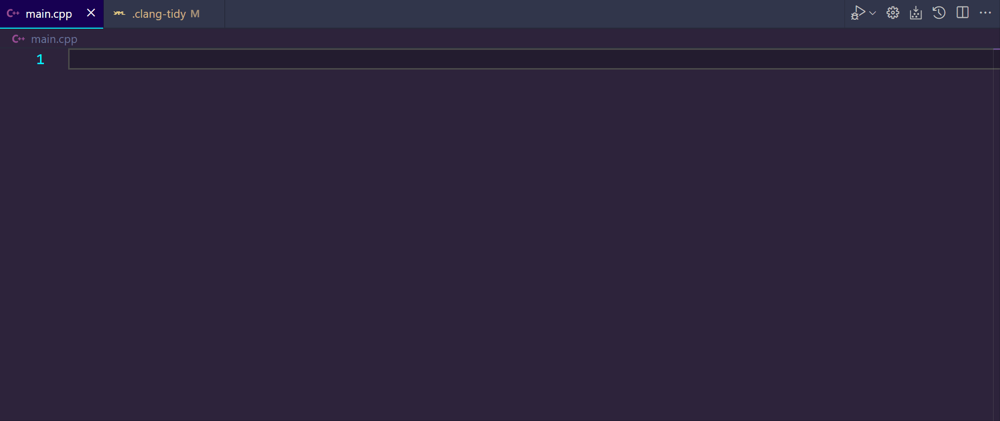

# clang-tidy README

This is the README for the "clang-tidy" VSCode extension, a powerful tool designed to enhance your C/C++ development experience by integrating the Clang Tidy linter and static analysis tool directly into VSCode.
Features

    On-the-Fly Linting: Analyze your C/C++ code with Clang Tidy as you type, providing instant feedback on potential issues.
    Configurable Analysis: Customize Clang Tidy checks using the extension settings.
    Chunk-Based Analysis: Process large files efficiently by analyzing them in manageable chunks.
    Parallel Processing: Leverage multi-core processors by running Clang Tidy checks in parallel.
    Interactive Diagnostics: View and navigate through the issues detected by Clang Tidy within VSCode.

## Requirements

Clang Tidy Installation: Ensure Clang Tidy is installed on your system. Refer to the official Clang Tidy documentation for installation instructions.

C/C++ Project Setup: Your C/C++ project should be set up with the necessary build configurations. 'compiled_commands.json' should be in the working directory in a build subdirectory.

Example;

    | Working directory
    |--- Build
    |------ compiled_commands.json

## Extension Settings

This extension contributes the following settings:

    clang-tidy.enable: Enable/disable the Clang Tidy extension.
    clang-tidy.configPath: Specify the path to the Clang Tidy configuration file.
    clang-tidy.chunkSize: Define the size of each chunk for processing large files.
    clang-tidy.maxCores: Set the maximum number of CPU cores to use for parallel processing.
    clang-tidy.displayInfoPopups: Toggle displaying information popups.
    clang-tidy.displayExtensionPopups: Toggle displaying popups for the active file extension check.
    clang-tidy.extensions: The file extensions that the extension should try running clang-tidy on, seperated by spaces.

## Known Issues

Limited support for very large files: Files beyond a certain size may not be processed optimally. Too many generated warnings will simply stop scanning for more. Splitting the file into many chunks removes context for analysis of parts of the file.

Dependency on project build configurations: The extension requires correct setup of build configurations for accurate analysis.

##Release Notes

### 1.0.0

Initial release of clang-tidy extension.

### 1.0.1

Fixed issue with file path handling.
Improved error messaging and configuration validation.

### 1.1.0

Added parallel processing support.
Enhanced chunk-based file analysis.

## Following Extension Guidelines

This extension follows the best practices as recommended in the Extension Guidelines.

##Working with Markdown
This README is authored in Markdown. For more information:

    Visual Studio Code's Markdown Support
    Markdown Syntax Reference

Enjoy using Clang Tidy in VSCode!
